## RAG Agent with Chainlit UI + FastAPI Backend with Multi-Agent Support

A comprehensive document Q&A platform featuring 8 different agent architectures, a Chainlit chat interface, FastAPI backend with OpenAI-compatible endpoints, and hybrid search over financial documents.

## Agent Architectures

| # | Agent | Description | Run Command |
|---|-------|-------------|-------------|
| 01 | LangChain Agent | Single agent using `create_agent` with tool calling and streaming. | `set AGENT=01_langchain_agent&& python main.py` |
| 02 | LangGraph Self-Correcting | Retrieves documents, generates an answer, and retries with a rewritten query if no relevant results are found. | `set AGENT=02_langgraph_self_correcting_agent&& python main.py` |
| 03 | LangGraph Supervisor | A supervisor routes requests to specialist agents (Financial, Legal Risk, Technical, Summary) and synthesizes the final response. | `set AGENT=03_langgraph_supervisor_agent&& python main.py` |
| 04 | CrewAI Agent | Single CrewAI agent with RAG tools. | `set AGENT=04_crewai_agent&& python main.py` |
| 05 | CrewAI Multi-Agent | Sequential workflow: Researcher → Analyst → Writer. | `set AGENT=05_crewai_multiagent&& python main.py` |
| 06 | AutoGen Multi-Agent | Round-robin collaboration: Planner → Researcher → Writer → Critic → Compiler. | `set AGENT=06_autogen_agent&& python main.py` |
| 07 | Microsoft Agent | Single agent built with the Microsoft Agent Framework. | `set AGENT=07_microsoft_agent&& python main.py` |
| 08 | Microsoft Multi-Agent | Parallel fan-out to four specialist agents followed by a fan-in synthesizer. | `set AGENT=08_microsoft_multiagent&& python main.py` |

## Database setup (first run)

python init_db.py

Creates data/chat_history.db with tables for users, threads, steps, feedbacks, and elements.

## How to start

**Start the FastAPI backend (choose one agent):**

1. Open app.py in Open in Integrated terminal
2. In terminal do: chainlit run app.py
3. Open routes.py in Open in Integrated terminal
4. I terminal choose multi-agent topology: 
set AGENT=01_langchain_agent&& python main.py
set AGENT=02_langgraph_self_correcting_agent&& python main.py
set AGENT=03_langgraph_supervisor_agent&& python main.py
set AGENT=04_crewai_agent&& python main.py
set AGENT=05_crewai_multiagent&& python main.py
set AGENT=06_autogen_agent&& python main.py
set AGENT=07_microsoft_agent&& python main.py
set AGENT=08_microsoft_multiagent&& python main.py
5. The[http://localhost:8000/login](http://localhost:8000/login)will be opened automaticaly and start chat with multi-agent.

# Linux/MacOS
AGENT=01_langchain_agent python main.py

### What it does

What it does
Document ingestion – Drag & drop PDFs/text files into the Chainlit UI. Files are chunked, embedded (OpenAI text-embedding-3-small), and stored in Qdrant with hybrid search (dense + sparse).

Metadata extraction – Parses SEC filings to extract company_name, doc_type (10-k/10-q/8-k), fiscal_year, and fiscal_quarter using a dedicated LLM prompt.

Multi-agent architectures – Choose from 8 different agent implementations (see below).

Streaming chat – Real-time token streaming via FastAPI SSE, displayed in Chainlit.

PDF export – Any response can be downloaded as a formatted PDF.

Tracing – Built-in support for LangSmith and CrewAI tracing.

## Tech Stack

| Component | Technology |
|-----------|------------|
| Chat UI | Chainlit |
| Backend API | FastAPI (OpenAI-compatible `/v1/chat/completions`) |
| Agent Frameworks | LangChain, LangGraph, CrewAI, AutoGen, Microsoft Agent Framework |
| LLM | OpenAI GPT-5 / Gemini (configurable) |
| Embeddings | OpenAI `text-embedding-3-small` |
| Vector Database | Qdrant (hybrid search) |
| Document Parser | RAGWire (custom ingestion) |
| Chat History | SQLite (via Chainlit data layer) |
| Tracing | LangSmith, CrewAI Traces |

### Agent logic (system prompt)

Breaks multi‑company or multi‑year comparisons into individual tool calls
Calls get_filter_context first when metadata is relevant
Always calls search_documents before answering
Bolds financial figures: **value**
Never invents answers — says "No relevant documents found"
Includes source attribution (filename + page)

### Metadata fields (SEC filings)

| Field | Example |
|-------|---------|
| `company_name` | `amazon.com inc.` |
| `doc_type` | `10-k`, `10-q`, `8-k` |
| `fiscal_year` | `2024` |
| `fiscal_quarter` | `q1`, `q2`, `q3`, `q4` (10‑Q only) |

### API endpoints (FastAPI)

| Endpoint | Method | Description |
|----------|--------|-------------|
| `/health` | GET | Health check |
| `/v1/models` | GET | List available models |
| `/v1/chat/completions` | POST | Streaming chat completions (SSE) |
| `/upload` | POST | Upload one or more documents |

### Example workflow

1. User uploads `GOOG-10-Q-2024-Q3.pdf`
2. System extracts: `company_name: alphabet inc.`, `doc_type: 10-q`, `fiscal_year: 2024`, `fiscal_quarter: q3`
3. User asks: "What was Alphabet's revenue in Q3 2024?"
4. Agent calls `get_filter_context`, then `search_documents` with filters
5. Returns answer with bolded numbers and source attribution
6. User clicks "Download PDF" to save the response

### Deploying FAST API in RENDER

FAST API was deploing in the render with all environment variables from Git Hub repository.
FAST API with AI server adress: https://ragwire-fast-api-rag-backend-dvn.onrender.com
To start Chainlit chat it is necessary to start command in Windows Power Shell:

& "D:\DataSience\Anaconda\shell\condabin\conda-hook.ps1"
conda activate ragwire-prod-rag
cd "E:\Advanced RAG Build & Deploy Production GenAI Apps\Working_Git_Versa_repositories\Big_projects\Multi_Agent_with_RAG_OpenAI_endpoints_ChainlitUI_download_pdf\Chainlit Chat Frontend"
chainlit create-secret 
$env:CHAINLIT_AUTH_SECRET="SECRET"
$env:FASTAPI_URL="https://ragwire-fast-api-rag-backend-dvn.onrender.com"; chainlit run app.py

### Deploying FAST API in RAILWAY

FAST API was deploing in the railway with all environment variables from Git Hub repository.
FAST API with AI server adress: https://ragwirefastapiragbackend-production.up.railway.app
To start Chainlit chat it is necessary to start command in Windows Power Shell:

& "D:\DataSience\Anaconda\shell\condabin\conda-hook.ps1"
conda activate ragwire-prod-rag
cd "E:\Advanced RAG Build & Deploy Production GenAI Apps\Working_Git_Versa_repositories\Big_projects\Multi_Agent_with_RAG_OpenAI_endpoints_ChainlitUI_download_pdf\Chainlit Chat Frontend"
chainlit create-secret 
$env:CHAINLIT_AUTH_SECRET="SECRET"
$env:FASTAPI_URL="https://ragwirefastapiragbackend-production.up.railway.app"; chainlit run app.py

### Deploying FAST API in GOOGLE CLOUD

FAST API was deploing in the railway with all environment variables from Git Hub repository.
FAST API with AI server adress: https://fastapi-rag-backend-499877968108.us-central1.run.app
To start Chainlit chat it is necessary to start command in Windows Power Shell:

& "D:\DataSience\Anaconda\shell\condabin\conda-hook.ps1"
conda activate ragwire-prod-rag
cd "E:\Advanced RAG Build & Deploy Production GenAI Apps\Working_Git_Versa_repositories\Big_projects\Multi_Agent_with_RAG_OpenAI_endpoints_ChainlitUI_download_pdf\Chainlit Chat Frontend"
chainlit create-secret 
$env:CHAINLIT_AUTH_SECRET="SECRET"
$env:FASTAPI_URL="https://fastapi-rag-backend-499877968108.us-central1.run.app"; chainlit run app.py

  
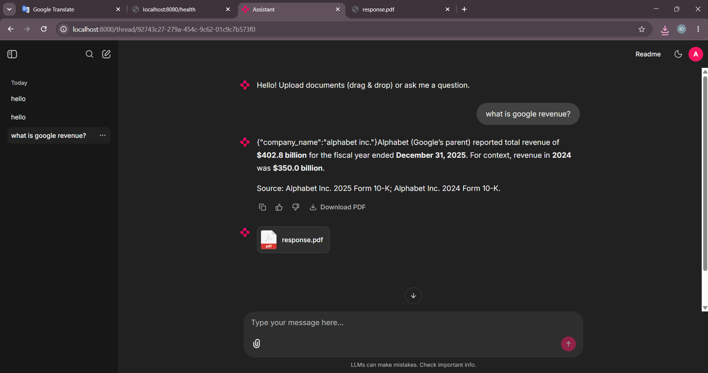  
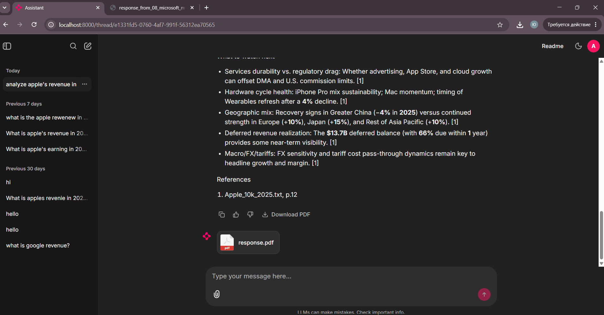  
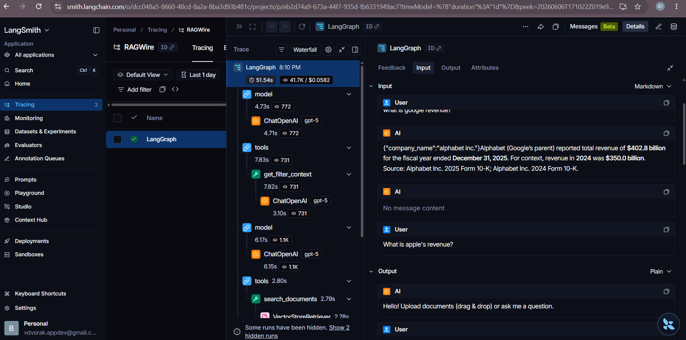  
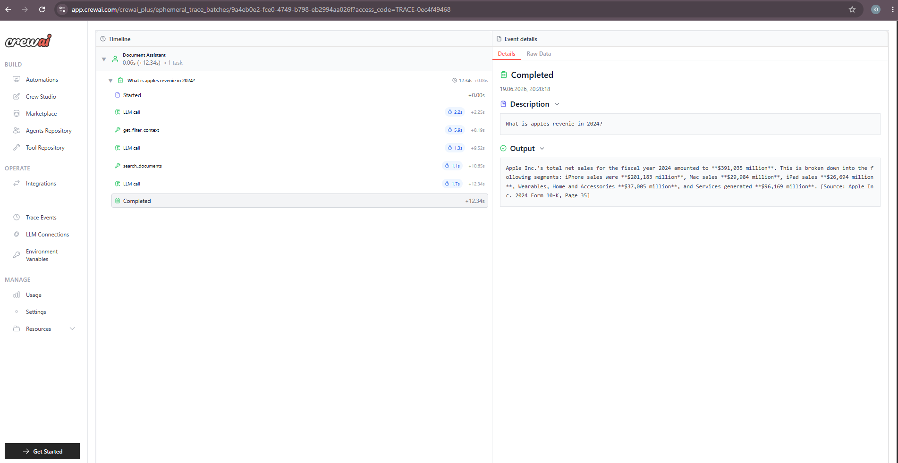  
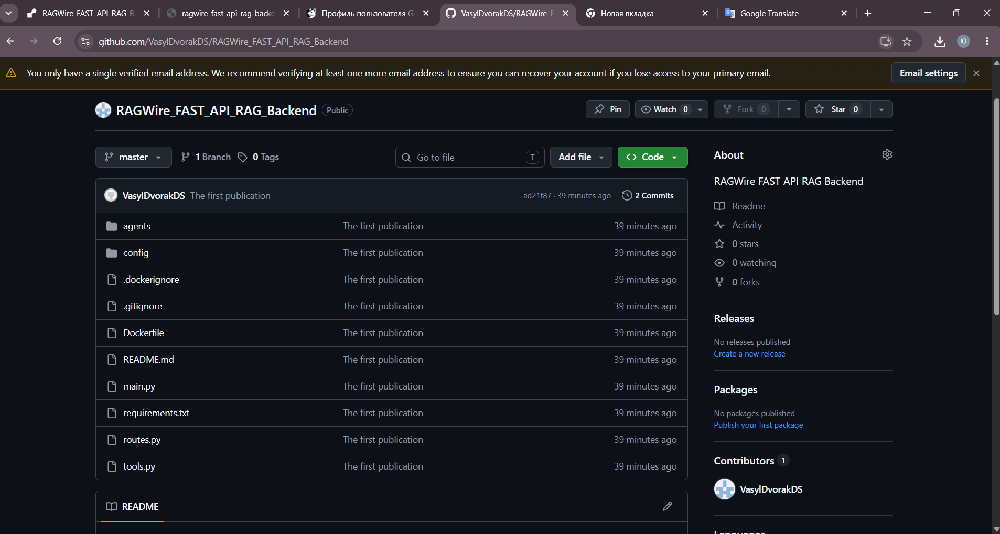  
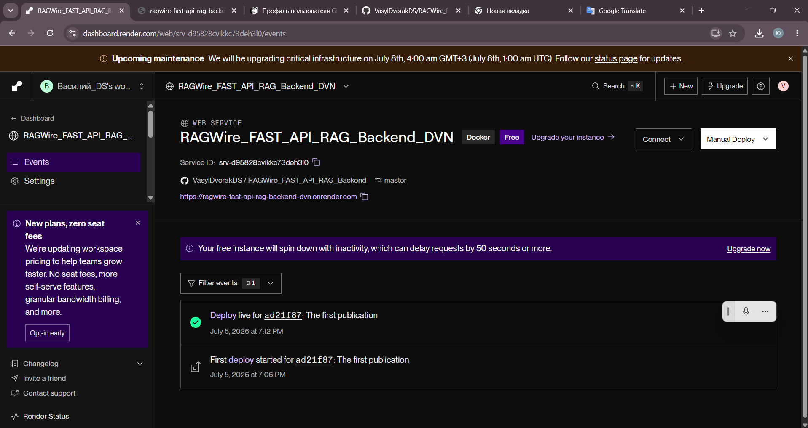  
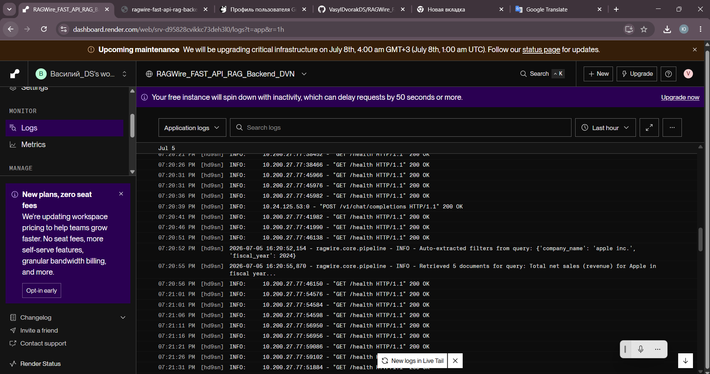  
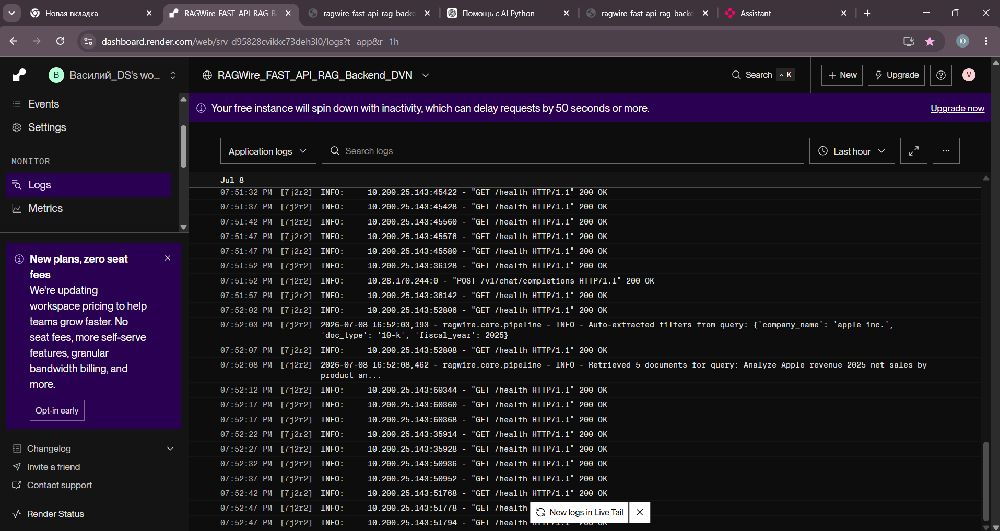  
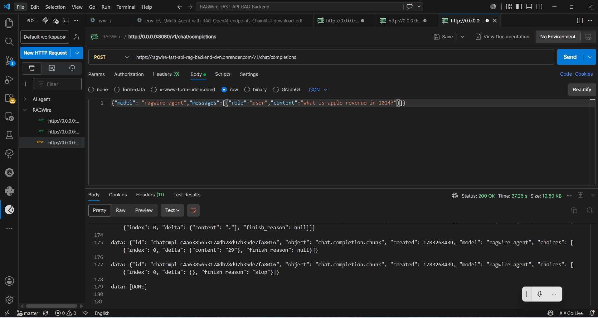  
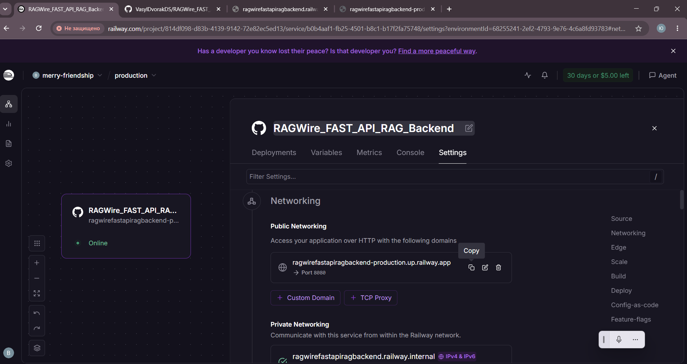  
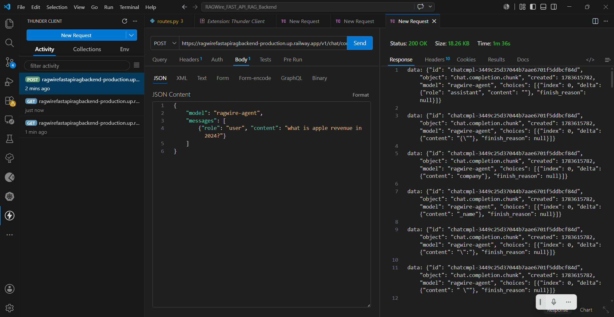  
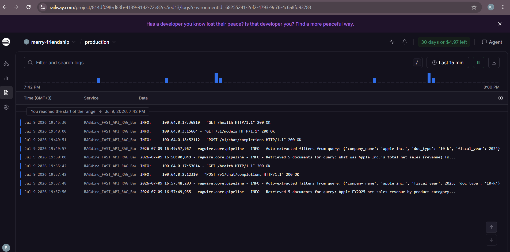  
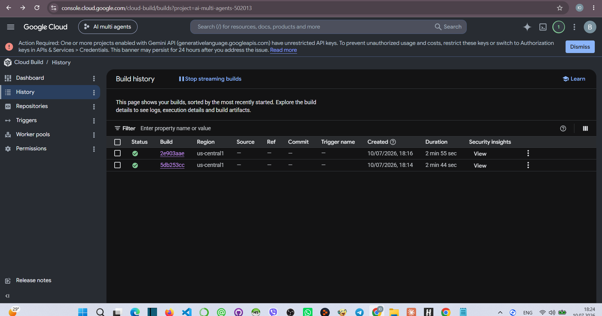  
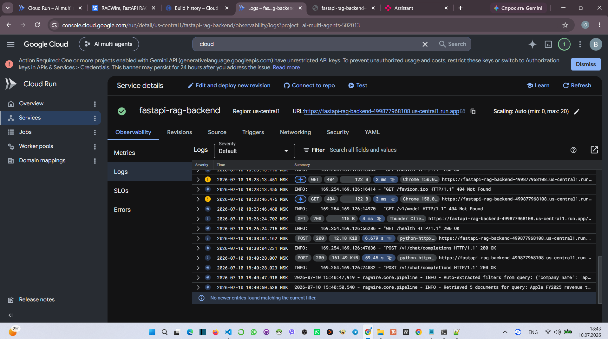  
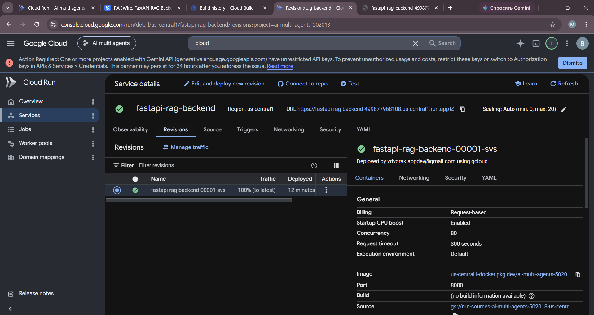  

